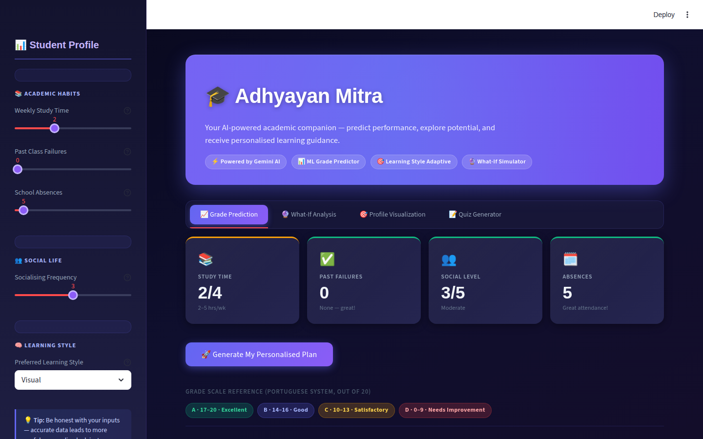
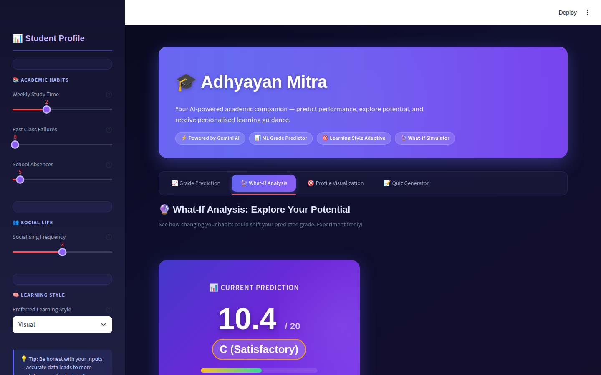
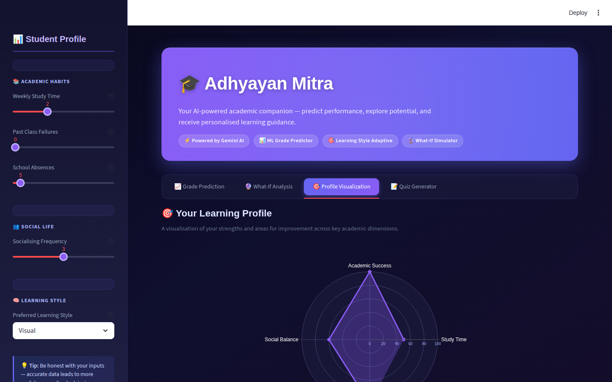
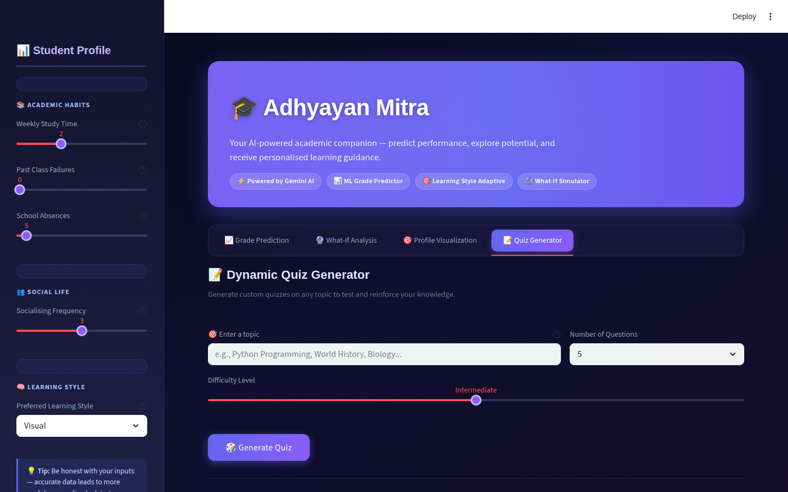

# 🧠 AI Personalized Learning Assistant

[](https://www.python.org/downloads/)
[](https://streamlit.io)
[](https://scikit-learn.org/stable/)
[](https://opensource.org/licenses/MIT)

A web application that uses a hybrid AI model to predict student performance and provide personalized, actionable feedback based on their unique learning style.

-----

## 📋 Table of Contents

  * [About The Project](https://www.google.com/search?q=%23about-the-project)
  * [Key Features](https://www.google.com/search?q=%23key-features)
  * [Tech Stack](https://www.google.com/search?q=%23tech-stack)
  * [Getting Started](https://www.google.com/search?q=%23getting-started)
      * [Prerequisites](https://www.google.com/search?q=%23prerequisites)
      * [Installation](https://www.google.com/search?q=%23installation)
  * [Usage](https://www.google.com/search?q=%23usage)
  * [Future Work](https://www.google.com/search?q=%23future-work)
  * [Acknowledgments](https://www.google.com/search?q=%23acknowledgments)

-----

## 📖 About The Project

Traditional education often provides generic advice that doesn't cater to the individual needs of students. This project addresses that gap by creating a personalized learning assistant that understands a student's habits and learning preferences.

Our solution uses a **hybrid AI approach**:

1.  **Prediction (The "What"):** A classical machine learning model (`RandomForestRegressor`) is trained on the UCI Student Performance dataset to accurately predict a student's final academic grade based on factors like study time, past failures, and social habits.
2.  **Personalization (The "Why" and "How"):** A Large Language Model (Google's Gemini) takes the model's prediction and the student's inputs—including their preferred learning style—to generate a supportive, actionable plan. It explains potential challenges and recommends specific, tailored resources.

-----

## ✨ Key Features

  * **Predictive Analytics:** Accurately predicts final grades ($G_3$) to identify students who may need support.
  * **Personalized Feedback:** Generates encouraging and supportive advice based on a student's unique situation.
  * **Learning Style Customization:** Adapts recommendations for **Visual**, **Auditory**, **Reading/Writing**, and **Kinesthetic** learners.
  * **Actionable Resource Recommendations:** Suggests specific, free online resources (videos, websites, tools) that align with the student's learning style.
  * **Interactive UI:** A simple and intuitive web interface built with Streamlit that allows for easy input and clear output.

-----

## 🛠️ Tech Stack

  * **Language:** Python
  * **Web Framework:** Streamlit
  * **Data Science & ML:** Pandas, Scikit-learn, Joblib
  * **Generative AI:** Google Gemini API (`google-generativeai`)

-----

## 🚀 Getting Started

Follow these instructions to set up and run the project on your local machine.

### Prerequisites

  * Python 3.9 or higher
  * A Google Gemini API key
  * The trained model file (`student_model.pkl`) and the `app.py` script.

### Installation

1.  **Clone the Repository**

    ```sh
    git clone https://github.com/your_username/your_project_repository.git
    cd your_project_repository
    ```

2.  **Create and Activate a Virtual Environment**

    ```sh
    # For Windows
    python -m venv venv
    .\venv\Scripts\activate

    # For macOS/Linux
    python3 -m venv venv
    source venv/bin/activate
    ```

3.  **Install Dependencies**
    Create a file named `requirements.txt` with the following content:

    ```
    streamlit
    pandas
    scikit-learn==1.3.2  # Use a specific version for model compatibility
    joblib
    google-generativeai
    python-dotenv
    ```

    Then, install the packages:

    ```sh
    pip install -r requirements.txt
    ```

4.  **Set Up API Keys**
    Create a file named `.env` in the root of your project folder. This file will securely store your API key.

    ```
    GEMINI_API_KEY="YOUR_GEMINI_API_KEY_HERE"
    ```

    You will also need to modify the `app.py` script slightly to load this key. Add these lines at the top:

    ```python
    from dotenv import load_dotenv
    load_dotenv()
    ```

-----


## 🏃 Usage

Once the installation is complete, you can run the application with a single command:

```sh
streamlit run app.py
```

Your web browser will automatically open to `http://localhost:8501`, where you can interact with the app.

-----

## 🔭 Future Work

This project has a strong foundation with many possibilities for future enhancements:

  * **Visual Student Profile:** Implement a radar chart (`Plotly`) to visually represent a student's habits.
  * **Dynamic Quiz Generation:** Allow users to input a topic and receive a custom-generated quiz from the LLM.
  * **Progress Tracking:** Add a database (`SQLite`) to allow users to save their inputs and track their predicted grade improvement over time.
  * **Advanced "What-If" Analysis:** Enhance the UI to better show how changing specific habits can impact the predicted outcome.

-----
## Gallery

### ✨ Redesigned UI (current)

| Tab | Preview |
|-----|---------|
| 📈 Grade Prediction |  |
| 🔮 What-If Analysis |  |
| 🎯 Profile Visualization |  |
| 📝 Quiz Generator |  |

### 🗂️ Original UI


## 🙏 Acknowledgments

  * This project uses the [Student Performance Data Set](https://archive.ics.uci.edu/ml/datasets/Student+Performance) from the UCI Machine Learning Repository.
  * P. Cortez and A. Silva. Using Data Mining to Predict Secondary School Student Performance. In A. Brito and J. Teixeira Eds., Proceedings of 5th FUture BUsiness TEChnology Conference (FUBUTEC 2008) pp. 5-12, Porto, Portugal, April, 2008, EUROSIS, ISBN 978-9077381-39-7.
